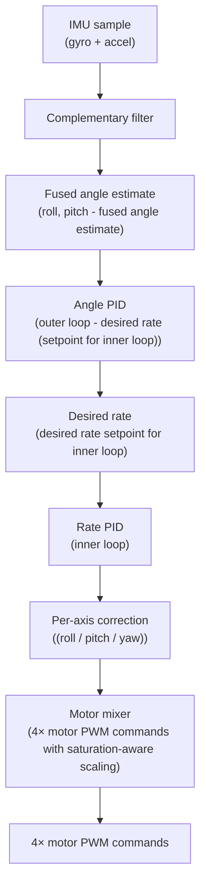

# Custom Quadcopter Flight Controller

A quadcopter flight controller built from scratch in C++ on an ESP32-S3 — no Betaflight, no existing flight-control firmware. 
Sensor fusion, cascaded PID control, and motor mixing are all self-written, with the explicit goal of understanding and implementing the control theory myself rather than configuring someone else's stack.

## Why this project

I wanted hands-on experience with the control theory and embedded systems work that goes into a real flight controller, rather than just flying a pre-built drone. 
The scope was deliberately narrow: write the PID loops, the complementary filter, and the motor mixing logic myself, while using well-tested libraries (Adafruit's MPU6050 driver).

## Hardware

Frame: QAV250 (250mm, 5" props)
MCU: ESP32-S3-DevKitC-1 (N16R8)
IMU: MPU6050 (I2C)
ESCs: 4× individual 30A ESCs (will change for AERO SELFIE 45A 4in1 ESC 2-6S)
Motors: Readytosky MT2204 2300KV (2× CW, 2× CCW) |
Battery: 3S LiPo
Toolchain: PlatformIO + Arduino framework

## Architecture

The control loop is a classic cascaded PID structure:

IMU sample (gyro + accel)
        │
        ▼
Complementary filter  ──►  fused angle estimate (roll, pitch)
        │
        ▼
Angle PID (outer loop)  ──►  desired rate (setpoint for inner loop)
        │
        ▼
Rate PID (inner loop)  ──►  per-axis correction (roll / pitch / yaw)
        │
        ▼
Motor mixer  ──►  4× motor PWM commands (with saturation-aware scaling)

- **Rate mode** was built and flight-validated first — a fixed rate setpoint of 0, tuned and tested in real untethered flight.
- **Angle (self-leveling) mode** feeds the angle loop's output in as the rate loop's setpoint, replacing the fixed 0 — the standard cascaded architecture. Yaw remains rate-only.
- **Sensor fusion**: a complementary filter (99.5% gyro integration / 0.5% accelerometer) rather than a Kalman filter — simpler to implement and reason about, and sufficient for a proof-of-concept build.
- **Motor mixing**: unclamped per-motor corrections are computed first, then a single scale factor is derived to keep every motor within PWM range without distorting the ratio between roll/pitch/yaw contributions — this was added after an early flight test revealed that individually-tuned single-axis gains didn't account for combined 3-axis demand exceeding available throttle headroom.

## Firmware structure

main.cpp        — setup()/loop() only; button handling; calls into other modules
motor.cpp/h     — LEDC PWM setup, duty-cycle conversion
mpu_setup.cpp/h — MPU6050 initialization
angle_pid.cpp/h — complementary filter, angle PID, main_pid() entry point
rate_pid.cpp/h  — rate PID, motor mixer, motor output

## Status

- ✅ Rate mode: tuned and validated in real free flight 
- ✅ Angle mode: implemented, cascade wired correctly, flight-tested at low-to-moderate throttle
- 🔧 In progress: characterizing an ESC-to-ESC output mismatch discovered via a swap test (isolated to one ESC unit, not the motors or wiring) that limits stable throttle range
- 🔧 In progress: Implementing a 4 in 1 ESC to decrease motor thrust inconsistencies 

## Debugging highlights

A few of the harder bugs, because the debugging process is arguably the more interesting part of a from-scratch build like this:

- **`dt` collapsing to near-zero**: a shared timestamp variable was being overwritten multiple times per loop iteration by different PID sub-functions, causing the derivative term to spike and the integral term to stop accumulating meaningfully.
  Fixed by making exactly one function, called once per loop, responsible for both computing `dt` and updating the timestamp.
- **Integral windup under mixer saturation**: per-axis integral clamping wasn't sufficient on its own, because the *global* mixer scale factor could still be shrinking the actual output even when a single axis's own bounds check passed.
  Fixed by gating integral accumulation on whether the mixer had to scale down on the previous iteration.
- **ESC output mismatch**: a swap test (physically exchanging which ESC drove which motor position) isolated a logarithmic thrust inconsistency (thrust inconsistencies varied based on varying motor speeds).
  Inconsistencies were so large a pure software fix (a fixed PWM trim) could only partially compensate for it.
  Solution will be using a higher quality 4in1 esc with calibration software so motor thrust inconsistencies will decrease allowing for the PID loop to effectively stabilize and change orientation quick enough.
